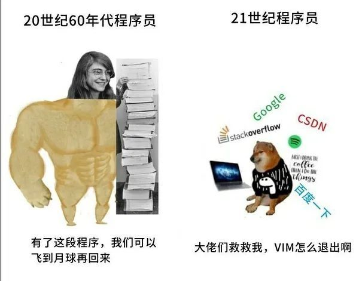

# 编程小实验

<figure><figcaption></figcaption></figure>

> Gitbook链接：[https://mr-zhenkongs-organization.gitbook.io/little-programming-experiments](https://mr-zhenkongs-organization.gitbook.io/little-programming-experiments)

### 1、尽量简单

编程入门是一件非常麻烦的事情，所以我们就弄得尽量简单一些。

以介绍基础概念为主，**每一小节只介绍一个新概念**，从一无所有的空白开始一步步添砖加瓦，逐步构建起真正可运行的代码。每节内容不会超过10分钟，然后留有30分钟的课后和练习时间。

每一小节只提供2道练习题，不多，所以可以在练习时间继续提问。

### 2、继续深入

由于本教程只是入门，所以在了解基础概念后，还需要再学习正式的编程教程。

不过相比于那些上来就列举所有特性、恨不得把一学期的内容全部塞到一小时之内的课程来说，本入门还是更轻松简单一些的。

### 3、在线运行

为了尽可能降低负担，我们使用在线编辑器来写代码，不需要预装任何软件。

[Python3 在线工具 | 菜鸟工具 (runoob.com)](https://c.runoob.com/compile/9/)

[C 在线工具 | 菜鸟工具 (runoob.com)](https://c.runoob.com/compile/11/)

如果想做更多练习，可以打开该网站：

[Python练习](https://exercism.org/tracks/python/concepts)

[C/C++练习](https://exercism.org/tracks/cpp/concepts)

