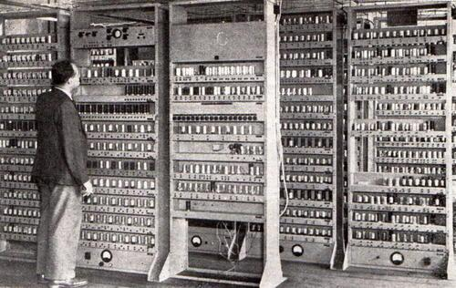
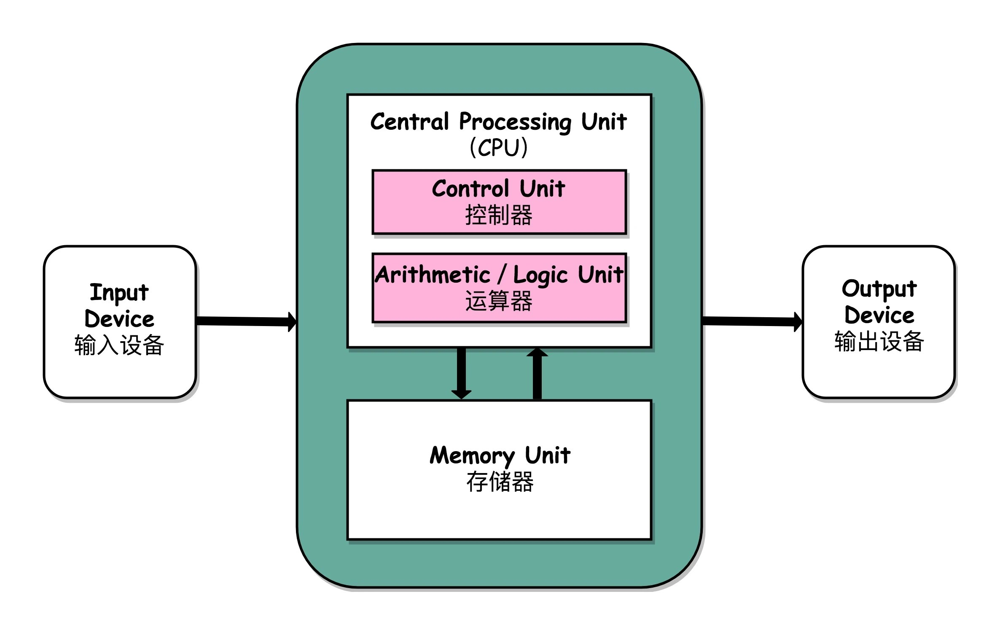

# 1、计算机的基本结构

在一切开始之前，我们先简单介绍一下计算机的基本结构。

知道我们从哪里来，将要做什么。

<figure><figcaption></figcaption></figure>

计算机的数学原理（数学模型）来源于**图灵机**，于1936年由艾伦·麦席森·图灵提出，它是一个通用计算模型，解决了如何让机器去模拟人类计算数学的问题。

我们的目前常用的电脑（物理计算机）来源于**冯诺依曼结构**，于1945年6月由约翰·冯·诺依曼与戈德斯坦、勃克斯等人提出，是目前最主流的计算机实现体系。

冯诺依曼结构由以下五部分组成：

* 运算器：例如ALU，算术逻辑单元，用于数学运算。
* 控制器：例如程序控制器，按顺序依次处理指令（一个指令一个指令执行）。
* 存储器：例如寄存器、内存，用于存储初始值、中间计算过程、结果值。
* 输入设备：例如键盘。
* 输出设备：例如显示器。

**运算器、控制器、以及寄存器组合起来，就是我们所熟悉的CPU（中央处理器）了，上述内容就变成了cpu、内存、键盘、显示器**。

除以上这些基础内容外，剩余的计算机组件属于锦上添花，而非最基础最不可或缺的部分。

<figure><figcaption></figcaption></figure>

到这里，我们就介绍了计算机的基本结构。

而了解这些内容有什么用呢？

接下来将为大家演示一个“魔法”，我们可以毫不夸张的说，**现在就可以拿出纸和笔，手动模拟执行上述的计算机了**。

当然，关于程序指令的细节，以及内存、cpu之间的交互细节没有提及（又是一个大篇幅）。

不过这并不影响我们可以**当场演示**——上面的这些计算机结构并不是花瓶，而是真真正正的**计算机器**。

数学原理已被前人证明，物理实现也被前人发明并完善，最终的这个结果，已经可以正式运行了。

（备注：详见演示白板）

（此小节练习题也详见白板手动模拟）
