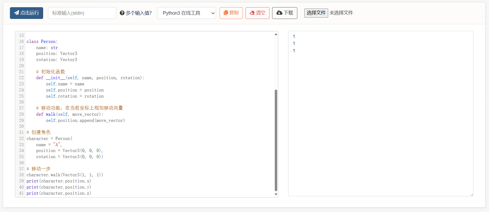

# 10、面向对象与抽象

在看上一节的案例，以及做练习题时，不知道大家有没有这样的疑问：那就是多了对象这一种东西，代码行数好像变多了、也更复杂了，它的好处是什么呢？

......

如果我们写代码只是写50行100行，那加入结构体/类可能好处并没有那么大。

但现实中的项目动辄上万行，多的有几百万行。之前我们书写的所有例子和练习题，其实都严重偏离真正的项目，也和真实的游戏不一样，其中的一个关键区别就在于：它们的抽象程度不够。下面我们来为大家列举一个实际的例子，来看看为什么前面的例子“抽象程度不够”。

例如：

```python
# 我们有一个物体的坐标信息
class Position:
    x: float
    y: float
    z: float

# 然后我们还有一个物体的旋转信息
class Rotation:
    x: float
    y: float
    z: float
```

它们两者在结构上是一致的，其数学本质也相同，因此可以统一抽象为一个物体，那就是向量：

```python
# 三维向量
class Vector3:
    x: float
    y: float
    z: float
```

下面我们来实际创建一个角色：

```python
# 向量
class Vector3:
    x: float
    y: float
    z: float
    
    def __init__(self, x, y, z):
        self.x = x
        self.y = y
        self.z = z

# 角色
class Character:
    name: str
    position: Vector3
    rotation: Vector3
    
    # 构造函数
    def __init__(self, name, position, rotation):
        self.name = name
        self.position = position
        self.rotation = rotation
    
    # 移动功能，在当前坐标上相加移动向量
    def walk(self, move_vector):
        self.position += move_vector

# 创建角色
character = Character(
    name = "A", 
    position = Vector3(0, 0, 0), 
    rotation = Vector3(0, 0, 0))

# 移动一步
character.walk(Vector3(1, 1, 1))
```

但此处又遇到了一个问题，那就是position是我们自定义的类型Vector3，是完完全全的白板类型。它没有加减乘除这些功能，因为我们没有写，所以计算机不知道怎么运行。如果你实际运行上面这段代码，会发现它会报错，错误就在第24行的“+=”操作符。

<figure><figcaption></figcaption></figure>

这就是在设计大量内容时我们会遇到的问题，每一个自定义类型一开始都是一张白纸，它们之间应该如何交互？每一个属性、每一个行为，我们都需要精心设计，就像是在编织一张巨大的网，哪一个节点要是没有与其他节点相连，它就会断开，出现错误。

为了解决这一问题，我们需要为向量增加加减功能：

```python
class Vector3:
    x: float
    y: float
    z: float
    
    def __init__(self, x, y, z):
        self.x = x
        self.y = y
        self.z = z
        
    def add(v1, v2):
        return Vector3(v1.x + v2.x, v1.y + v2.y, v1.z + v2.z)

class Character:
    name: str
    position: Vector3
    rotation: Vector3
    
    def __init__(self, name, position, rotation):
        self.name = name
        self.position = position
        self.rotation = rotation
    
    # 移动功能，在当前坐标上相加向量
    def walk(self, move_vector):
        self.position = Vector3.add(self.position, move_vector)

# 创建角色
character = Character(
    name = "A", 
    position = Vector3(0, 0, 0), 
    rotation = Vector3(0, 0, 0))

# 移动一步
character.walk(Vector3(1, 1, 1))
print(character.position.x)
print(character.position.y)
print(character.position.z)
```

<figure><figcaption></figcaption></figure>

向量加减，位置移动的功能有了。但好像显示向量还不方便，不过这里我们就不添加了，读者可以自行添加向量的显示函数。

下面我们继续写例子。创建一个角色系统，用来管理、访问所有的角色，新增一个游戏功能：让角色（npc）随机在地图中乱逛。

```python
class Vector3:
    ...

class Character:
    ...

class CharacterSystem:
    character_list: list
    
    # 创建角色
    def create(self, number):
        character_list = []
        for i in range(number):
            character = Character(
                name = name_library.random(), 
                position = Vector3(0, 0, 0), 
                rotation = Vector3(0, 0, 0)
            )
            self.character_list.append(character)
    
    # 按名字寻找角色
    def find(self, name):
        for i in character_list:
            if i.name == name:
                return i
        return None
      
    # 新增游戏功能，让角色（npc）随机在地图中乱逛
    def wander(self):
        for npc in character_list:
            x = random.randint(-1, 1)
            y = random.randint(-1, 1)
            z = random.randint(-1, 1)
            npc.walk(Vector3(x, y, z))

# 启动角色系统
character_system = CharacterSystem()
character_system.create(100)
character_system.wander()
```

下面增加一个动画系统，动画系统分为：角色拥有骨骼，骨骼拥有坐标和旋转信息，动画文件拥有骨骼的帧偏移数据。

当角色移动时，动画系统负责播放移动动画（动画效果）。

```python
# 向量
class Vector3:
    ...

# 骨骼
class Bone:
    part: str
    position: Vector3
    rotation: Vector3
    
    # 根据数据适配骨骼节点
    def apply(self, data):
        position = data.get(self.part).position
        rotation = data.get(self.part).rotation

# 角色
class Character:
    ...
    bones: list
    
    # 适配骨骼
    def create_bones(self, bones_data):
        bones = []
        for data in bones_data:
            bone = Bone(Vector3(0, 0, 0), Vector3(0, 0, 0))
            bone.apply(data)
            self.bones.append(bone)
    
    # 移动功能，自动播放动画
    def walk(self, move_vector):
        self.position = Vector3.add(self.position, move_vector)
        animation = animation_system.find("move")
        animation.play(self.bones)
        
# 角色系统
class CharacterSystem:
    ...
    # 创建角色
    def create(self, number, bones_data):
        # 创建骨骼数据
        character.create_bones(bones_data)
        ...
    
    # 按名字寻找角色
    def find(self, name):
        ...
    
    # 角色（npc）随机在地图中乱逛
    def wander():
        for npc in character_list:
            x = random.randint(-1, 1)
            y = random.randint(-1, 1)
            z = random.randint(-1, 1)
            npc.walk(Vector3(x, y, z))  # 移动时自动播放动画

# 动画文件
class Animation:
    name: str
    total_frame: float
    current_frame: float
    offset_data: list
    
    # 根据动画帧数据和目标骨骼，偏移变换节点
    def play(self, bones):
        data = offset_data.get(current_frame)
        for bone in bones:
            bone.apply(data)
        current_frame += 1
        if current_frame > total_frame:
            current_frame = 0

# 动画系统
class AnimationSystem:
    animation: list
    
    # 加载动画文件
    def load(self):
        files = util.read("game/animation").suffix(".anim")
        animation = files.to_list(typeof(Animation))
    
    # 寻找对应名称的动画文件
    def find(self, name):
        for i in animation:
            if i.name == name:
                return i
        return None
```

然后我们还需要添加一个主系统，按照游戏帧渲染，一帧帧驱动角色系统的移动和动画系统的播放（帧播放），例如一些早期的主机游戏都是固定30帧执行游戏（逻辑运算）。

不过这里就不举例了，实际上我们编写游戏时不需要从底层重新写，因为大部分功能现代的游戏引擎都准备好了。

***

此处仅为一个例子，它向我们展示了如何搭建一张大网，将每个节点一一连接。

在这之中我们只需要注意一点：那便是【复杂度的抽象】。

当我们设计出Vector3这一类时，向量其实还有加减、点乘、叉乘、单位向量、规范化等等功能，这些都归属于向量本身。就像是一个黑盒子，内部装有各种功能，而外人只要按照约定使用即可，无需关心它具体的数学公式是什么。例如：

```python
class Vector3:
    x: float
    y: float
    z: float
    
    def __init__(self, x, y, z): ...
    def add(v1, v2): ...
    def dot(v1, v2): ...
    def mul(v1, v2): ...
    def normalize(self): ...
    def zero(): ...
    def one(): ...
```

同理，面对骨骼，动画文件，角色，角色系统，动画系统等等，我们也只需要关心他们暴露在外面的公共方法/属性，而不需要关心他们内部自己的实现。

```python
class Bone:
    def apply(self, data): ...
    
class Character:
    def create_bones(self, bones_data): ...
    def walk(self, move_vector): ...

class CharacterSystem:
    def create(self, number): ...
    def find(self, name): ...
    def wander(self): ...

class Animation:
    def play(self, bones): ...

class AnimationSystem:
    def load(self): ..
    def find(self, name): ...
```

这就是通俗意义上的接口，也就是api的思想（Application Programming Interface），一种程序对接的约定。

它们构成了功能的基石，例如向量，后续无论是角色移动、旋转，还是播放动画（动画骨骼的移动和旋转），还是UI的弹窗、镜头的晃动、下落的雨雪等等，其底层都是已经封装好了的功能。（当然，实际使用中我们会用别人写好的库，它们更全面，但底层思想是一致的）

衍生开来，其实在访问操作系统的时候也是如此，在控制台输出信息，借用的就是操作系统提供的接口。这些接口就是一系列的函数，例如刷新窗口、传输字符等等。但我们不需要关心，因为python官方已经把它们封装为了一个简单的函数，print。

这样一层层的抽象，最终就构成了极其庞大的游戏引擎和各种基础功能。我们实际使用移动时，也不需要像本案例一样重复造轮子，而是直接用现成的坐标和旋转功能，需要完全自定义的也就是我们自己的玩法，例如攻击伤害、角色对话、ai行为、按键映射等等。

至此，我们所有基础内容的章节就结束了。下面是一些简单的练习题，然后下一大章就不再有练习了，直接现场演示在游戏引擎中编程，原理是相通的。


**10-1、练习题**

练习1：


```python
# 还记得最上面那个案例我们说显示向量不太方便吗，请在Vector3类中添加一个显示函数：
# 具体写法随意，目标是让Vector3类打印信息，例如：(1, 1, 1)
```


练习2：


```python
# 自己设计一个角色类Character、背包类Backpack、以及物品类Item，它们的关系为：
# 角色拥有背包，背包装载物品，物品拥有名称、坐标和旋转
# 角色拥有查看背包的功能view_backpack
# 背包拥有查看物品的功能view_item
# 物品拥有显示信息的功能print_info
# 请书写一段代码，创建角色、背上背包、塞入物品，最终触发角色查看背包，显示所有物品
```


