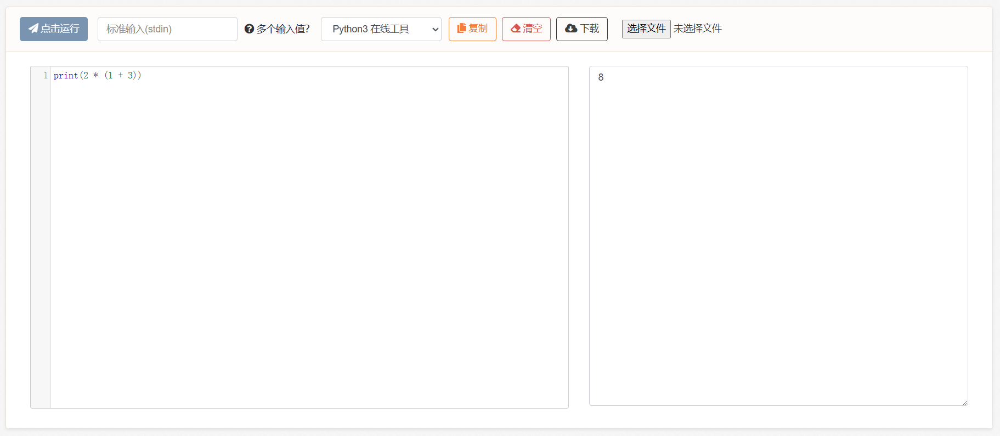

# 2、算术表达式

现在我们来看一个最简单的咒语，算术表达式：

```python
2 * (1 + 3)
```

它会在程序运行后算出结果值：8。（虽然我们不能直接看见）

算术表达式提供了这样一个东西，和数学式子一样，使用中缀表达式书写1+2，计算机便会按照式子进行计算并得出结果。当然了，它的组成也是最简单的，其中`+-*/`等运算符表示加减乘除，圆括号表示算术优先级，以及其他一些运算符号。这就是一句最简单的咒语了。

不过仔细想一想还是蛮神奇的，它知道什么是加法、什么是乘法，计算机变成了一台【计算】机，只要我们念出咒语，它就会自动执行。

想要看见结果（打印在控制台中），我们可以使用：

```python
print(2 * (1 + 3))
```

运行结果：&#x20;

<figure><figcaption></figcaption></figure>

**2-1、练习题**

练习1：


```python
# 已知圆的面积公式为pi乘以r的平方
# 现在公园里有一个半径为2.682的喷泉，请计算pi取3.14时，该圆的面积
```


练习2：


```python
# 现在任天堂ns主机的售价为2340港元，请换算成当前汇率的人民币
```


