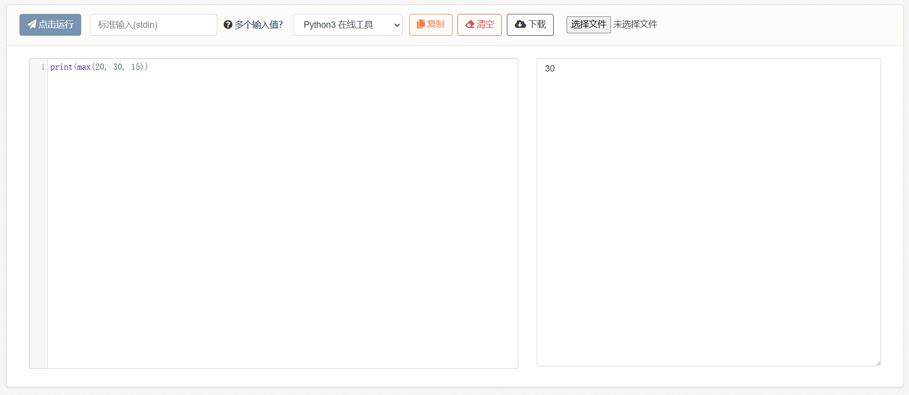
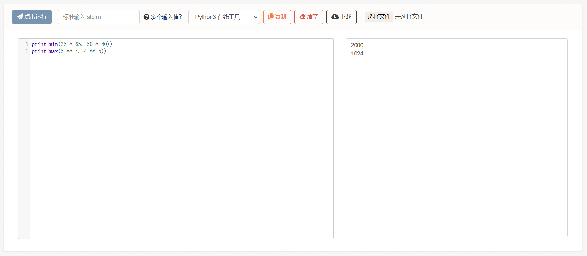

# 3、调用表达式

光有算术表达式太基础了，我们来一步步增加新功能。

新增调用表达式，即调用函数。关于函数的具体细节会在第5节中介绍，本小节只负责用、大家先熟悉一下用法。函数是一种处理过程，它的写法与数学中的函数类似，f(x)，x为参数，f(x)为结果，即输入参数、返回结果，例如：

```python
max(1, 5, 2) 
```

> 它会找到输入值中最大的那个数字，并返回，在这个例子中是5。

```python
min(10, 14, 9)
```

> 它会找到输入值中最小的那个数字，并返回，在这个例子中是9。

调用表达式的语法规则为：

```
操作符(操作数1, 操作数2, ...)
```

例如在上面这两个例子中，操作符（函数名）就是max和min，操作数（参数）就是1、5、2等等。

***

这里提到的“返回”，大家可以简单理解为代换结果，例如：

```python
max(1, 2)
# 等价于：2，即max(1, 2) -> 2

min(10, 20)
# 等价于: 10，即min(10, 20) -> 10

max(1, 2) + min(10, 20)
# 等价于: 2 + 10
```

不严谨的说，“代换”的过程就是计算机执行“计算”的过程，函数即是对过程的抽象。

有了这些函数，我们就可以很方便地书写和使用各种“计算过程”。

python官方内置的函数除此之外还有很多（[Python 3 文档](https://docs.python.org/zh-cn/3/library/functions.html)），例如abc(x)取x的绝对值，pow(x, n)计算x的n次幂等等。我们后续也可以书写自己的函数并使用，不过本小节暂时只用官方的函数。

***

下面我们来实现一个效果，输入精神攻击力20、物理攻击力30、灵魂攻击力15，取三者之中最高的一种输出出去。其中，print也是一个函数，所以这里是嵌套书写，类似于f(f(x))：

```python
print(max(20, 30, 15))
```

<figure><figcaption></figcaption></figure>

然后我们开始施展魔法。

**表达式和语句作为最基础的代码组成部分，它们是可以相互嵌套的**。

例如，我们可以将精神、物理、灵魂攻击力，修正上它们的偏移值，然后取修正后的三者之中最高的攻击力，乘以攻击系数1.5，然后减去对方的防御力10，得出伤害值（相当于伤害计算公式）：

```python
print(max(20 - 5, 30 + 3, 15 + 6) * 1.5 - 10)
```

<figure><figcaption></figcaption></figure>

也可以比较两个矩形的面积谁更小，或是5的4次方和4的5次方谁更大：

```python
print(min(35 * 65, 50 * 40))
print(max(5 ** 4, 4 ** 5))
```

<figure><figcaption></figcaption></figure>

**3-1、 练习题**

题目1：


```python
# 现在我们有4颗树，高度分别为2.5，8.53，9.01，14.15
# 请写一段代码，它的功能是：得出最高的树和最低的树之间的高度差，并计算在该差值内间隔1.5放置一个圣诞树灯泡，一共可以放置几个。
```


题目2：


```python
# 现在我们有一个数字，假设是3.14
# 请写一段代码，它的功能是：将输入数字约束在0-1之间，如果它大于1，则输出1；如果它小于0，则输出0；如果它在0-1之间，则输出它自己。
# 备注：不准使用超纲的条件判断语句，只允许使用max和min函数。
```


