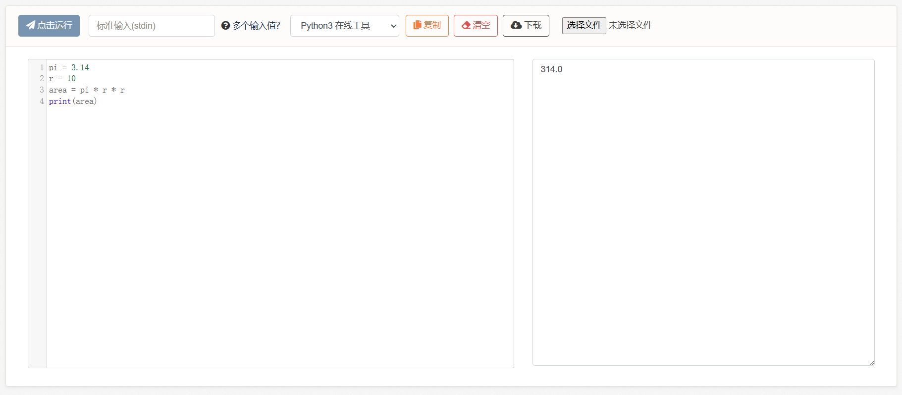

# 4、赋值语句与变量

在写上一节的练习题时，不知道大家有没有感觉到代码有些“拥挤”。

好像一堆代码都挤在了一行，能不能写成很多行？并且好像怎么全都是算术计算，有没有什么更复杂的功能？**我们先解决第一个问题（把代码写成很多行），第二个问题（更实用的功能）要放到if条件语句章节再讲**。

***

“代码全都挤在一行”这个问题出在中间过程上，在前面的例子中，我们没有“指代”一个式子或一个结果的能力，因此无法分为多行，例如数学中的令z=x+y之类的。如果有指代的功能，就能分步骤描述一个过程，例如令x=a1，y=a2，最终结果z=sqrt(x\*x+y\*y)。

从这个角度说，我们需要一种存储中间计算的机制。

现在为大家添加这个功能：赋值。

```python
变量名 = 表达式
```

这里的“=”等号被称为赋值符号，整一句话被称为赋值语句。它的功能是将一个值或表达式的结果绑定到一个名字上，并使用该名字指代其内容，例如：

```python
pi = 3.14
r = 10
area = pi * r * r
print(area)
```

<figure><figcaption></figcaption></figure>

这个名字被称为变量名，这个东西被称为变量。例如在这个例子中，我们绑定了pi为3.14，绑定了半径r为10，然后计算了面积的表达式，并将结果值绑定到了area上（注意：python并没有绑定一个表达式，而是绑定了它计算后的结果）。最终打印area的内容，输出结果。

而变量之所以叫做【变】量，是因为它可以重复绑定内容，刷新其中的数据（相当于覆写）：

```python
hp = 20
hp = min(20, 10)
print(hp)
```

<figure><figcaption></figcaption></figure>

借助这个特性，我们可以书写意象不到的魔法：

```python
hp = 20
attack = 15

hp = hp - attack
print(hp)
```

<figure><figcaption></figcaption></figure>

这是因为赋值语句的顺序是，先计算右侧的表达式，再通过赋值符号“=”等号，绑定给左侧的变量名。因此在计算右边的hp时，此时hp还等于20，等到计算完成后，hp才被赋值为了5。

由此可以实现数据初始化和计算公式之间的分离，即：

```python
# 数据初始化
hp = 20
attack = 15

# 计算公式
hp = hp - attack

# 打印结果
print(hp)
```

阅读顺序为：初始化hp、attack的值，计算hp-attack（伤害公式）并将结果保存为hp，实现血量的刷新。

> 备注：截止本小节为止，我们已经可以做到算术、函数、变量三者的相互嵌套了。事实上它们三者的排列组合足以实现非常复杂的效果。


**4-1、练习题**

题目1：


```python
# 一个伤害计算公式的例子：输入精神攻击力20、物理攻击力30、灵魂攻击力15，取三者之中最高的一种输出，并乘以攻击系数1.5，然后减去对方的防御力10，得出伤害值。
# 请参考本节案例，书写伤害计算公式，并实现数据初始化和公式之间的分离。
```


题目2：


```python
# 现在我们来复合一下之前的例子，实现一个比较复杂的效果。
# 有4颗树，高度分别为2.5，8.53，9.01，14.15，我们需要在最高的树和最低的树之间（高度差），按照1.5的间隔放置圣诞树灯。每个球形灯泡的价格与其横截面面积有关，假设该灯泡半径为0.1，每1单位的横截面积的价格与一台港版任天堂ns主机的2340港元相当。请计算出我们一共需要几个灯泡，每个灯泡多少人民币，一共需要几人民币。
```


