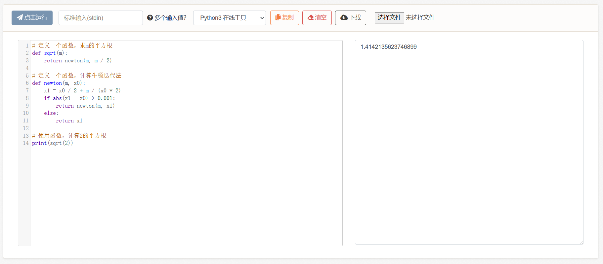

# 5、函数

在写前面的练习题时，代码功能一多，代码行数一多，好像又显得有些“拥挤”了。这是因为我们没有划分代码之间的功能，使得所有过程都挤在了一起。

而把过程分离成一个个模块，这就是函数。

如果说变量是把一个数据与一个名称绑定，那么函数就可以是把一堆过程与一个名称绑定在一起，并提供了输入和输出。我们也可以说，函数是对过程的抽象，例如：

```python
# 定义函数
def get_area(r):
    pi = 3.14
    area = pi * r * r
    return area

def get_price(hkd):
    return hkd * 0.92

# 使用函数
area = get_area(0.1)
cny = get_price(area * 2340)
print(cny)
```

<figure><figcaption></figcaption></figure>

语法规则为：

```python
def 函数名(参数):
    过程
    return 返回结果
```

其中，函数在写法上也可以没有参数，例如get\_today()，或没有返回值，例如print()，或既没有参数也没有返回值，例如stop()等等。

而和前面的所有功能一样，函数内部也可以嵌套表达式和语句。而函数内部的变量被我们称为【局部变量】，名称和外部不冲突，当函数运行完成后它就会被释放（消失），因此最后我们需要把结果给return回去（如果需要返回值的话）。

例如：

```python
def get_today():
    return "2024/4/1"

# 接收函数的返回值（如果有的话），绑定到一个名称上，最后打印日期
today = get_today()
print(today)
```

又例如：

```python
def print_today():
    today = "2024/4/1"
    print(today)

# 没有返回值，直接触发函数
print_today()
```

<figure><figcaption></figcaption></figure>

<figure><figcaption></figcaption></figure>

但函数的魔力不止于此。

***

它真正的威力在于，递归：

```python
# 定义一个函数
def fib(n):
    if n == 0 or n == 1:
        return 1
    else:
        return fib(n - 1) + fib(n - 2)

# 使用函数，输出n为8时斐波那契数列的值
print(fib(8))
```

这是一个斐波那契数列计算公式：

> 斐波那契数列（Fibonacci sequence），因数学家莱昂纳多·斐波那契（Leonardo Fibonacci）以兔子繁殖为例子而引入，故又称“兔子数列”，其数值为：1、1、2、3、5、8、13、21、34…… 在数学上，这一数列以如下递推的方法定义：F(0)=1，F(1)=1，F(n)=F(n - 1)+F(n - 2)（n ≥ 2，n ∈ N\*）

当我们输入`fib(8)`时，程序进入函数fib中：

* 此时n=8，进行if条件判断：当n等于0或1时，返回`1`，否则返回`fib(n-1)+fib(n-2)`。此时由于n=8，所以返回结果是`fib(7)+fib(6)`。
* 然后`fib(7)`又按照上述过程，展开为`fib(5)+fib(4)`。
* `fib(6)`按照上述过程，展开为`fib(3)+fib(4)`。
* 以此类推，直到`fib(0)或fib(1)`，返回`1`。

结果就变成了1+1+1+...，最终累加为34。

<figure><figcaption></figcaption></figure>

大家可以手算验证一下，整体计算过程长得和一棵树一样，不断分叉，最终的枝叶就是1。

那么这种功能还能干什么呢？例如，可以计算平方根：

```python
# 定义一个函数，求m的平方根
def sqrt(m):
    return newton(m, m / 2)

# 定义一个函数，计算牛顿迭代法
def newton(m, x0):
    x1 = x0 / 2 + m / (x0 * 2)
    if abs(x1 - x0) > 0.001:
        return newton(m, x1)
    else:
        return x1

# 使用函数，计算2的平方根
print(sqrt(2))
```

这个例子比起前一个更复杂一些，但原理是一样的。我们自定义了一个函数名为sqrt：它接收一个参数，返回它的平方根。然后我们实现了sqrt函数的细节，即调用牛顿迭代法。

牛顿迭代法也是一个我们自定义的函数newton，它有些特殊，会不断调用自己，直至满足精确度条件（误差在0.001之内），才会返回结果。

<figure><figcaption></figcaption></figure>

> 至于牛顿迭代法内部具体是怎么迭代的，可以参考：[一文看懂牛顿法（附Python实现） - 知乎 (zhihu.com)](https://zhuanlan.zhihu.com/p/105265432)。

**不过这其实也不太重要，因为函数的一大特点就是黑箱：我们只需要知道输入参数是什么、输出结果是什么，内部是怎么实现的不太需要关心**。我们可以不了解不动点方程、不了解开方运算，只要了解如何使用它，就像我们使用max、min一样。

这也可以被称为“许愿机制”，即我们许愿sqrt平方根函数已经被乔治写好了，可以拿过来直接使用。

而当我们将它视为一个已经写好的东西时，函数就变成了一个基本元素，就像使用加减乘除符号一般，将一大堆过程封装成了一个简单操作，这即是抽象。它隐藏了复杂度，降低了人的思考成本，为构建更大型的、复杂的项目提供了基底。


**5-1、练习题**

题目1：


```python
# 已知阶乘的公式为：n!=n*(n-1)*(n-2)*...*1
# 请书写一段代码，计算n=9时，它的阶乘。
```


题目2：


```python
# 现在我们再来实现一遍这个例子，加入函数，把各个代码功能划分清晰：
# 我们有4颗树，高度分别为2.5，8.53，9.01，14.15，我们需要在最高的树和最低的树之间（高度差），按照1.5的间隔放置圣诞树灯。每个球形灯泡的价格与其横截面面积有关，假设该灯泡半径为0.1，每1单位的横截面积的价格与一台港版任天堂ns主机的2340港元相当。请计算出我们一共需要几个灯泡，每个灯泡多少人民币，一共需要几人民币。
```


