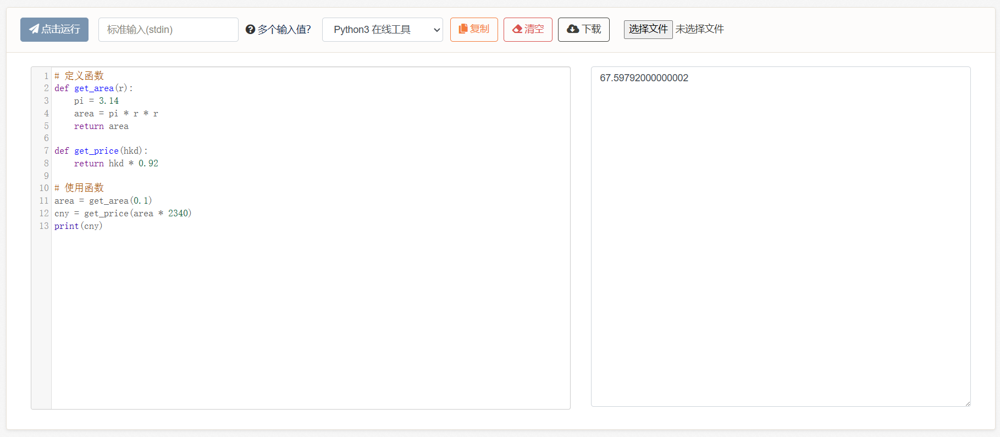

# 5-1、函数

在写前面的练习题时，代码功能一多，代码行数一多，好像又显得有些“拥挤”了。这是因为我们没有划分代码之间的功能，使得所有过程都挤在了一起。

而把过程分离成一个个模块，这就是函数。

* 如果说，**变量是把一个数据与一个名称绑定**。
* 那么，**函数就是把一堆过程与一个名称绑定**。并提供了输入和输出。

我们也可以说，函数是对过程的抽象，例如：

```python
# 定义函数
def get_area(r):
    pi = 3.14
    area = pi * r * r
    return area

def get_price(hkd):
    return hkd * 0.92

# 使用函数
area = get_area(0.1)
cny = get_price(area * 2340)
print(cny)
```

<figure><figcaption></figcaption></figure>

语法规则为：

```python
# 定义函数
def 函数名(形参):
    过程
    return 返回结果

# 使用函数，其实就是我们前面提到的调用表达式
函数名(实参)
```

函数的书写分为**定义**和**使用**两个步骤：

* **定义**是用def关键字（在其他编程语言中也可能是fn、func、function等关键字）来向编译器声明我们需要将一个过程与一个名称进行绑定。
* 在绑定的过程中，我们需要写下函数名、参数（可以有很多个）、过程、返回结果。
* 之后便是**使用**调用表达式，来调用函数。

像前面例子中用到的max和min等官方内置函数，它们的def定义就写在内置模块中，程序运行后可以自动使用，不需要我们再重复定义一遍。而我们自己的函数（函数定义）则放在自己的代码中，相当于我们的本地代码库。而如果想要引用更多别人写好的函数（功能），还可以导入官方库或第三方库，这在后文的条件语句章节有实际案例。

***

**下面我们来讲一下函数定义里面具体怎么写：**


```python
# 定义函数
def 函数名(形参):
    过程
    return 返回结果
```


定义时的形参（形式参数），区别于使用时的实参（实际参数），其实就是取一个本地名称。例如`def get_hp(character)`，声明一个获取角色血量的函数。在外面使用函数时假设我们写`get_hp(character_1)`，`get_hp(character_2)`，无论外面具体使用什么名称，在函数里面都统一叫做本地名称，即character。

例如：


```python
# 定义函数，接收一个参数名为character
def get_hp(character):
    hp = character.hp
    print(hp)

# 使用函数
get_hp(zhang_san)    # 输入zhang_san，张三
get_hp(li_si)        # 输入li_si，李四
```


在定义函数的写法上，函数也可以没有参数，例如：


```python
def get_today():
    return 今天的日期
```


或没有返回值（没有return），例如：


```python
def new_print(content, end):
    print(content + end)
```


或既没有参数也没有返回值，例如：


```python
def stop():
    程序停机
```


而和前面的所有功能一样，函数内部也可以嵌套表达式和语句。而函数内部的变量被我们称为【局部变量】，例如形参就是局部变量，除此之外我们也可以自己声明新的变量，它们本质上就是计算的中间步骤，名称和外部不冲突，当函数运行完成后它们就会被释放（消失），因此最后我们需要把结果给return回去（如果需要返回的话）。

例如：

```python
def get_today():
    return "2024/4/1"

# 接收函数的返回值，绑定到一个名称上，最后打印日期
today = get_today()
print(today)
```

又例如：

```python
def print_today():
    today = "2024/4/1"
    print(today)

# 没有返回值，直接触发函数
print_today()
```

<figure><figcaption></figcaption></figure>

<figure><figcaption></figcaption></figure>

**5-1、练习题**

题目1：


```python
# 现在我们再来实现一遍这个例子，加入函数，把各个代码功能划分清晰：
# 我们有4颗树，高度分别为2.5，8.53，9.01，14.15，我们需要在最高的树和最低的树之间（高度差），按照1.5的间隔放置圣诞树灯。每个球形灯泡的价格与其横截面面积有关，假设该灯泡半径为0.1，每1单位的横截面积的价格与一台港版任天堂ns主机的2340港元相当。请计算出我们一共需要几个灯泡，每个灯泡多少人民币，一共需要几人民币。
```


