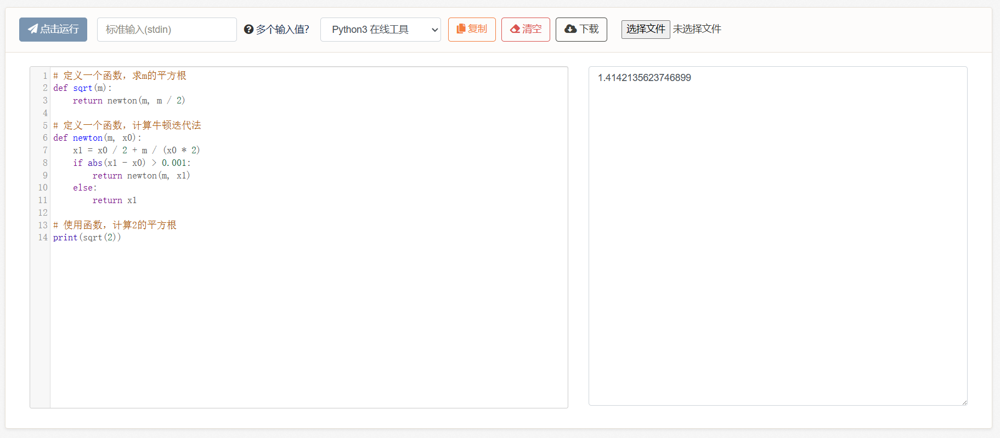

# 5-2、递归

但函数的魔力不止于此。

它真正的威力在于，递归：

```python
# 定义一个函数
def fib(n):
    if n == 0 or n == 1:
        return 1
    else:
        return fib(n - 1) + fib(n - 2)

# 使用函数，输出n为8时斐波那契数列的值
print(fib(8))
```

这是一个斐波那契数列计算公式：

> 斐波那契数列（Fibonacci sequence），因数学家莱昂纳多·斐波那契（Leonardo Fibonacci）以兔子繁殖为例子而引入，故又称“兔子数列”，其数值为：1、1、2、3、5、8、13、21、34…… 在数学上，这一数列以如下递推的方法定义：F(0)=1，F(1)=1，F(n)=F(n - 1)+F(n - 2)（n ≥ 2，n ∈ N\*）

当我们输入`fib(8)`时，程序进入函数fib中：

* 此时n=8，进行if条件判断：当n等于0或1时，返回`1`，否则返回`fib(n-1)+fib(n-2)`。此时由于n=8，所以返回结果是`fib(7)+fib(6)`。
* 然后`fib(7)`又按照上述过程，展开为`fib(6)+fib(5)`。
* `fib(6)`按照上述过程，展开为`fib(5)+fib(4)`。
* 以此类推，直到`fib(0)`或`fib(1)`，返回`1`。

结果就变成了1+1+1+...，最终累加为34。

<figure><figcaption></figcaption></figure>

大家可以手算验证一下，整体计算过程长得和一棵二叉树一样，不断分叉，最终的枝叶就是1。

那么这种功能还能干什么呢？例如，可以计算平方根：

```python
# 定义一个函数，求m的平方根
def sqrt(m):
    return newton(m, m / 2)

# 定义一个函数，计算牛顿迭代法
def newton(m, x0):
    x1 = x0 / 2 + m / (x0 * 2)
    if abs(x1 - x0) > 0.001:
        return newton(m, x1)
    else:
        return x1

# 使用函数，计算2的平方根
print(sqrt(2))
```

这个例子比起前一个更复杂一些，但原理是一样的。我们自定义了一个函数名为sqrt：它接收一个参数，返回它的平方根。然后我们实现了sqrt函数的细节，即调用牛顿迭代法。

牛顿迭代法也是一个我们自定义的函数newton，它有些特殊，会不断调用自己，直至满足精确度条件（误差在0.001之内），才会返回结果。

<figure><figcaption></figcaption></figure>

> 至于牛顿迭代法内部具体是怎么迭代的，可以参考：[一文看懂牛顿法（附Python实现） - 知乎 (zhihu.com)](https://zhuanlan.zhihu.com/p/105265432)。

**不过这其实也不太重要，因为函数的一大特点就是黑箱：我们只需要知道输入参数是什么、输出结果是什么，内部是怎么实现的不太需要关心**。我们可以不了解不动点方程、不了解开方运算，只需要了解如何使用它，就像使用max、min一样。

这也可以被称为“许愿机制”，即我们许愿sqrt平方根函数已经被乔治写好了，可以拿过来直接使用。

而当我们将它视为一个已经写好的东西时，函数就变成了一个基本元素，就像使用加减乘除符号一般，将一大堆过程封装成了一个简单操作，这即是抽象。它隐藏了复杂度，降低了人的思考成本，为构建更大型的、复杂的项目提供了基底。


**5-2练习题**

题目1（不过练习题还是得自己写的，不要用别人写好的数学库）：


```python
# 已知阶乘的公式为：n!=n*(n-1)*(n-2)*...*1
# 请书写一段代码，计算n=5时，它的阶乘。结果应该是120。
```


