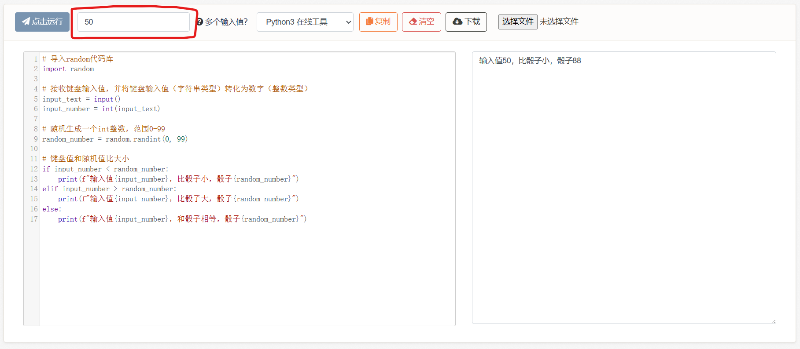
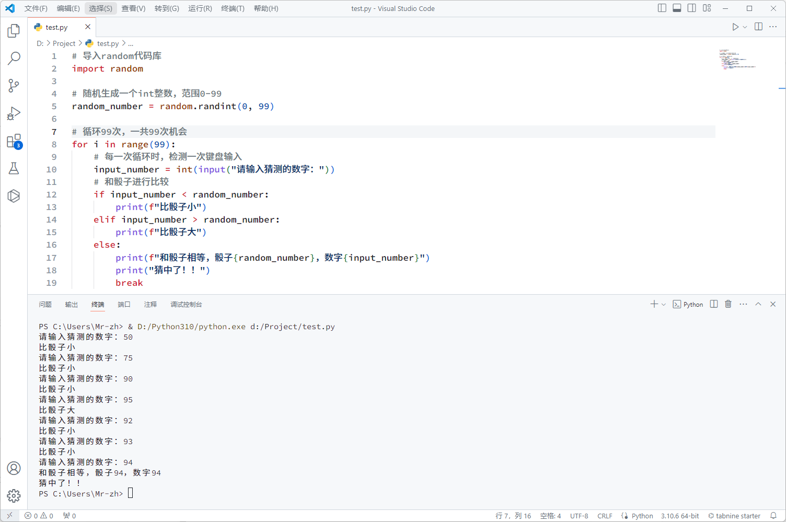

# 7、条件判断语句

本小节开始介绍前面提到的if条件判断语句。

除了常规的计算外，我们还有各种程序控制语句，包括条件分支、循环执行等。其实在写例子时也能感觉到，只有过程，而没有条件判断，其实做不了太繁复的事情，例如检测键盘输入、如果按下移动键、角色向前移动，如果玩家血量小于0、则触发死亡动画等等。

例如：

```python
key = input()
if key == "w":
    print("玩家向前移动")

hp = 20
if hp <= 0:
    print("玩家死亡")
else:
    print("玩家血量健康")
```

<figure><figcaption></figcaption></figure>

它的语法规则是：

```python
if 判断表达式:
    如果为真，则执行这段代码
else:
    如果为假，则执行这段代码
```

判断表达式和算术表达式类似，只不过判断表达式只能返回true或false，其中我们需要用到比较符号：

* \==，等于
* !=，不等于
* \>=，大于等于
* <=，小于等于
* \>，大于
* <，小于&#x20;

例如：

```python
# 新建变量
x = 10

# 可以只有if，没有else
if x != 10:
    print("x不等于10")

# 也可以既有if又有else，意为如果...否则...
if x == 10:
    print("x等于10")
else:
    print("x不等于10")
  
# 还可以是if-elif-else，如果...再如果...再如果...否则...
if x < 0:
    print("低于0分？")
elif x < 60:
    print("不及格")
elif x < 80:
    print("及格")
elif x < 90:
    print("优秀")
elif x <= 100:
    print("卓越")
else:
    print("突破100分？")

# 嵌套使用（其实所有的语句都可以嵌套使用）（注意缩进，同一缩进的为同一个代码块）
if x >= 10:
    if x >= 20:
        print("x大于等于20")
    print("x大于等于10")

# 也可以把判断表达式写在外面
flag = x >= 10    # 这里flag的数据类型是bool布尔类型，只有ture和false两种可能
if flag:
    print("判断为真")
else:
    print("判断为假")
```

除此之外还有逻辑运算符：

* and，并且
* or，或者
* not，取反

```python
x = 10
if x >= 0 and x <= 99:
    print("x大于等于0并且x小于等于99")
else:
    print("x小于0或者x大于99")

if x < 100 or x > 200:
    print("x小于100或者x大于200")
else:
    print("x大于等于100并且x小于等于200")

if not x == 10:
    print("x不等于10")
else:
    print("x等于10")
```

if语句的规则确实多，稍微看看就行了。

***

然后我们来实践一下：

**一个小游戏，随机扔一个0-99的骰子，然后用键盘输入一个数字，和骰子比大小**。

```python
# 导入random代码库
import random

# 接收键盘输入值，并将键盘输入值（字符串类型）转化为数字（整数类型）
input_text = input()
input_number = int(input_text)

# 随机生成一个int整数，范围0-99
random_number = random.randint(0, 99)

# 键盘值和随机值比大小
if input_number < random_number:
    print(f"输入值{input_number}，比骰子小，骰子{random_number}")
elif input_number > random_number:
    print(f"输入值{input_number}，比骰子大，骰子{random_number}")
else:
    print(f"输入值{input_number}，和骰子相等，骰子{random_number}")
```

由于在线运行不支持实时检测键盘输入（可能是考虑到安全），所以我们使用提前输入框，将键盘猜测提前写在输入框内，然后运行代码，查看结果：

<figure><figcaption></figcaption></figure>

关于import导入代码库，random库的randint随机函数，内置的input输入函数、int整数转换函数等等，我们不会详细解释，遇到了搜索引擎问一下就行，由于python非常流行所以这方面的教程也非常多，不再赘述。

上面这个例子只能输入一次，和真实的游戏不太一样，下面我们给一个真实的案例。

如果各位本地装有vscode编辑器和python运行环境，则可以试试以下代码。因为是本地运行，所以可以实时检测键盘输入、猜测骰子，更接近实际的游戏。

```python
# 导入random代码库
import random

# 随机生成一个int整数，范围0-99
random_number = random.randint(0, 99)

# 循环99次，一共99次机会
for i in range(99):
    # 每一次循环时，检测一次键盘输入
    input_number = int(input("请输入猜测的数字："))
    # 和骰子进行比较
    if input_number < random_number:
        print(f"比骰子小")
    elif input_number > random_number:
        print(f"比骰子大")
    else:
        print(f"和骰子相等，骰子{random_number}，数字{input_number}")
        print("猜中了！！")
        break
```

运行结果：&#x20;

<figure><figcaption></figcaption></figure>

**7-1、练习题**

练习1：


```python
# 已知input为官方自带的键盘输入函数。
# 请书写代码，实现以下功能：当输入w/a/s/d时，打印玩家向前/后/左/右移动。
```


练习2：


```python
# 已知导入随机数代码库为import random，随机数生成函数为random.randint(n, m)
# 接着上一个例子，设置玩家的初始坐标为x=0，y=0，然后用随机数生成一个随机坐标，其数值为-1到1之间的整数，例如x=1，y=-1；或x=0，y=1等等。
# 然后加入以下判断：当输入w/a/s/d时，玩家的坐标向前/后/左/右移动。并和随机坐标进行比较，是否相等，如果相等，打印到达坐标xxx；否则，打印与随机坐标之间的距离。
```


