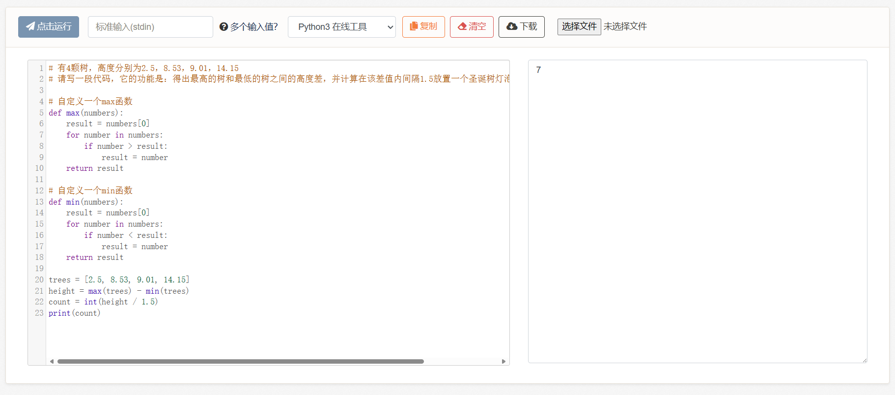

# 8、复合类型与循环语句

在上一节的例子中，我们有一闪而过用到for循环语句。没有循环语句，我们就无法连续猜测骰子，因此本小节重点讲解它。

不过在讲循环之前，要先介绍一下复合数据类型：

> 在之前的练习题中，不知道大家是怎么把那4颗树放在一起的（求最高的树和最低的树之间的差值）。如果是10颗、100颗呢？显然，我们希望能有一个变量，直接引用那一堆数据，例如图片images=一堆东西，又例如树trees=一堆东西。这就是复合数据类型。

本次先介绍把一组相同类型的数据复合在一起的方法，称为数组/列表。

然后下一节会介绍把不同类型的数据组合在一起并抽象成一个对象的方法，称为结构体/类。

***

数组/列表：

```python
trees = [2.5, 8.53, 9.01, 14.15]
```

访问时如下使用：

```python
print(trees[0])    # 第一个（00号）元素
print(trees[1])    # 第二个（01号）元素
print(trees[2])    # 第三个（10号）元素
print(trees[3])    # 第四个（11号）元素，以此类推
```

> 备注：这被称为下标索引，索引值程序员习惯从0开始，到n-1结束。索引值需要在其数组长度之内，大于等于长度会报错。

数组和列表在概念上的区别是：

* 数组一般是固定长度的一组数据，不能随意增删，例如一张1920\*1080的图片，像素点只能置零，不能删除或增加。
* 列表一般是可变长度的一组数据，可以增加和删除节点，例如音乐播放歌单，加入播放列表或移除歌曲。

当然，不同的语言有不同的实现原理，具体细节千差万别。本教程就笼统介绍，以数组/列表来统称这一复合类型，我们以介绍概念为主，不以具体的语言为桎梏。

然后我们还有一种更方便的访问一组数据的方式，那就是for循环（不同语言的for循环写法可能不一样，需要注意一下）：

```python
trees = [2.5, 8.53, 9.01, 14.15]
for i in trees:
    print(i)
```

<figure><figcaption></figcaption></figure>

实现的效果是，循环访问一个数组/列表。语法规则是：

```python
for 临时变量 in 数组/列表:
    依次访问数组/列表中的元素
```

例如我们可以实现这样的效果：

```python
# 自定义一个max函数
def max(numbers):
    result = numbers[0]
    for number in numbers:
        if number > result:
            result = number
    return result

# 使用它
foo = [0, 5, -20, 40, 13, 2]
print(max(foo))
```

<figure><figcaption></figcaption></figure>

我们自定义了一个max函数，虽然和原版的不太一样（它们使用了另外的功能），但效果是相同的，即找出一堆数据中最大的那一个。大家读一读这个max函数的实现，应该能读懂检测的逻辑。

如法炮制，我们可以制作不使用官方函数就完成所有自己练习题的例子（print函数除外）。这也算是一种去魅了，现在我们来剥离max和min的魔法：


```python
# 有4颗树，高度分别为2.5，8.53，9.01，14.15
# 请写一段代码，它的功能是：得出最高的树和最低的树之间的高度差，并计算在该差值内间隔1.5放置一个圣诞树灯泡，一共可以放置几个。

# 自定义一个max函数
def max(numbers):
    result = numbers[0]
    for number in numbers:
        if number > result:
            result = number
    return result

# 自定义一个min函数
def min(numbers):
    result = numbers[0]
    for number in numbers:
        if number < result:
            result = number 
    return result 

trees = [2.5, 8.53, 9.01, 14.15]
height = max(trees) - min(trees)
count = int(height / 1.5)
print(count)
```


<figure><figcaption></figcaption></figure>

**8-1、练习题**

练习1：


```python
# 已知官方内置的range函数可以生成数组/列表，用法是：
# range(0, 5)返回[0, 1, 2, 3, 4]
# range(10, 15)返回[10, 11, 12, 13, 14]
# range(5)等效于range(0, 5)，返回[0, 1, 2, 3, 4]
# range(10)等效于range(0, 10)，返回[0, 1, 2, 3, 4, 5, 6, 7, 8, 9]

# 例如：for i in range(5):
#          print(i)
# 打印：0 1 2 3 4

# range函数和正常的函数没区别，它也可以嵌套变量，例如：
# n = 5
# for i in range(n):
#     print(i)
# 打印：0 1 2 3 4

# 请书写一段代码，功能是打印0-100内所有的奇数。（奇数可以用取余2时余数等于1来判断）
```


练习2：


```python
# 已知for循环是可以嵌套for循环的（其实所有的语句都可以嵌套）。
# 嵌套两层被称为双重循环，三层被称为三重循环。

# 在双重循环中，我们假设第一层循环变量为i、第二层循环变量为j，例如：
# for i in ...:
#    for j in ...:
#        ...
# 而在嵌套时，range等所有函数也都是可以使用循环变量的，这是解题的关键。

# 请书写一个双重循环，功能是打印99乘法表，打印函数我们提前给出来是：
# print(f"{i} * {j} = {i * j}")

# 要求输出结果如下：
1 * 1 = 1

2 * 1 = 2
2 * 2 = 4

3 * 1 = 3
3 * 2 = 6
3 * 3 = 9

4 * 1 = 4
4 * 2 = 8
4 * 3 = 12
4 * 4 = 16

5 * 1 = 5
5 * 2 = 10
5 * 3 = 15
5 * 4 = 20
5 * 5 = 25

6 * 1 = 6
6 * 2 = 12
6 * 3 = 18
6 * 4 = 24
6 * 5 = 30
6 * 6 = 36

7 * 1 = 7
7 * 2 = 14
7 * 3 = 21
7 * 4 = 28
7 * 5 = 35
7 * 6 = 42
7 * 7 = 49

8 * 1 = 8
8 * 2 = 16
8 * 3 = 24
8 * 4 = 32
8 * 5 = 40
8 * 6 = 48
8 * 7 = 56
8 * 8 = 64

9 * 1 = 9
9 * 2 = 18
9 * 3 = 27
9 * 4 = 36
9 * 5 = 45
9 * 6 = 54
9 * 7 = 63
9 * 8 = 72
9 * 9 = 81
```


