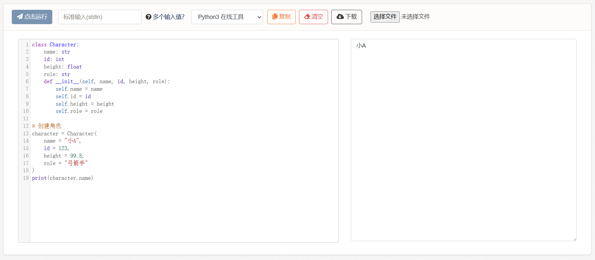
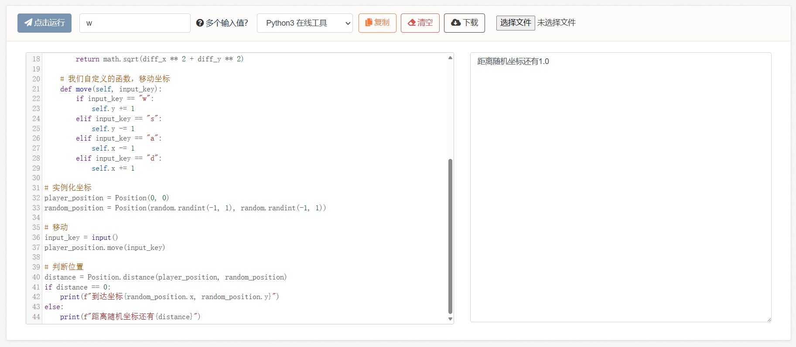

# 9、对象

前面我们介绍了一组同类型的数据，数组/列表。现在我们来介绍一组不同类型的数据并将其整体抽象为一个对象，称为结构体/类。

或许有读者会问，为什么上面这句话多了一句“并将其整体抽象为一个对象”，如果删掉它会怎么样。我们先看看只是把一组不同类型的数据放在一起的样子，能不能像这样摆放：

```python
list = ["文字", 123, 99.8, "文字2"]
```

答案是可以的，不同语言或多或少都支持类似功能的复合类型。但这种数据的实用意义不大，至少相比于真正常用的那些不大。

真正常用的其实是这种：

```python
character = Character(
    name = "小A",
    index = 123,
    height = 99.8,
    role = "弓箭手"
)
```

不同类型的数据之间往往有含义，而这些含义共同组成了一个对象，例如这里的角色，包含角色的姓名、角色的编号、角色的职业等等。各种数据并非独立存在，而是处于一个整体之中。这就是我们本次要介绍的复合数据类型：结构体/类。

***

不过在此之前，我们要解释【对象】这一概念，结构体/类也将是大家目前为止学到的最复杂的类型。

我们先提一个问题：假设有这样一个角色，他包含血量、攻击力、防御力，然后还具有攻击能力（函数）。接着我们创建两个角色，让这两个角色相互攻击，直到某一方死亡，得出胜利者。

有了以上需求，我们该如何写代码呢？

是长这样吗？

```python
def attack_character(hp, attack, defense):
    return hp - (attack - defense)
    
# 角色1
hp_1 = 20
attack_1 = 10
defense_1 = 5

# 角色2
hp_2 = 30
attack_2 = 15
defense_2 = 1

# 循环攻击直至出现胜利者
...
```

按照我们已学的知识点，确实只能这么摆，把一个角色的血量放一边，把另一个角色的血量放另一边。但这样的代码绝对说不上优美，也让人感觉哪里有什么地方不对劲。

到底是哪里不对劲呢？

**和我们之前遇到的例子都不同，本小节有了一个新的事物——复杂物体之间的交互。**

或者也可以叫做对象（object），在游戏中，多个物体之间互动可以说是再正常不过，当我们把世界划分为一个个物体并尝试相互影响、修改时，我们就会遇到“如何描述物体”的问题。

解决方法在前面也有说明：那就是复合类型。把若干小数据组合成一个大数据，我们不是在计算零散的血量和攻击，而是在计算角色A的血量、角色B的攻击、角色A的防御。而角色A有自己的各种数值，角色B也有他的数值，它们共享一个角色模板，区别在于参数不同。

这便是结构体/类，它们的内部会存储两个东西，一个是数据、一个是与数据绑定的名称，例如当我们访问角色的"姓名"时，它会指向数据"小A"。**而更妙的是，它们不仅可以内置变量，还可以内置函数**。函数也可以理解为绑定了一堆过程的名称，通过角色对名称的访问，我们不仅可以获得姓名，还可以获得行为。这一点将改变我们对复合类型的一般认知，因为它将迎来质变。

在结构体/类中，内置变量可以称为属性，内置函数可以称为方法。例如我们为角色增加一个内置函数，名为talk：

```python
# 声明一个类，名为Character
class Character:
    name: str
    index: int
    height: float
    role: str
    
    def talk(self):
        print(self.name)

# 实例化这个类，创建一个角色
character = Character()
character.name = "小A"
character.index = 123
character.height = 99.8
character.role = "弓箭手"

# 访问角色的属性（使用“.”操作符）
print(character.name)
print(character.index)
print(character.height)
print(character.role)

# 访问角色的方法（使用“.”操作符）
character.talk()
```

<figure><figcaption></figcaption></figure>

语法规则是：

```python
class 类名:        # 类名默认使用帕斯卡命名法，和变量名做区分
    属性1: 类型
    属性2: 类型
    def 方法1: ...
    def 方法2: ...

变量名 = 类名()      # 类的创建函数，该函数名与类名相同
变量名.属性          # 通过“.”点操作符访问类的属性和方法
变量名.方法
```

除此之外，它还可以增加构造函数，实现快速初始化：

```python
# 声明一个类，名为Character
class Character:
    name: str
    index: int
    height: float
    role: str
    
    # 官方的特殊函数，用来初始化
    def __init__(self, name, index, height, role):
        self.name = name
        self.index = index
        self.height = height
        self.role = role
    
    # 我们自定义的函数
    def talk(self):
        print(self.name)

# 使用构造函数快速地创建角色
character = Character(
    name = "小A", 
    index = 123, 
    height = 99.8, 
    role = "弓箭手"
)
print(character.name)
```

<figure><figcaption></figcaption></figure>

结构体/类是一种特殊的复合类型，它们不仅可以内置变量，还可以内置函数。

这么做的想法是让单独的数据变成一个有意义的物体，例如角色，角色拥有属性、行为。**这就是面向对象思想的开始，将世界划分为一个个物体，无数物体彼此相互影响**，形成一个巨大的世界。关于更多面向对象的思维，我们会在下一节介绍，本小节仅举例一些基本案例。

现在我们来写一个更实际的例子。

例如之前7-1的练习题2，有一个坐标的案例，这个二维坐标其实就可以包装为一个整体、抽象为一个对象：


```python
# 已知导入随机数代码库为import random，随机数生成函数为random.randint(n, m)
# 接着上一个例子，设置玩家的初始坐标为x=0，y=0，然后用随机数生成一个随机坐标，其数值为-1到1之间的整数，例如x=1，y=-1；或x=0，y=1等等。
# 然后加入以下判断：当输入w/a/s/d时，玩家的坐标向前/后/左/右移动。并和随机坐标进行比较，是否相等，如果相等，打印到达坐标xxx；否则，打印与随机坐标之间的距离。
import random
import math

# 声明一个类
class Position:
    x: int
    y: int
    
    # 官方的特殊函数，用来初始化
    def __init__(self, x, y):
        self.x = x
        self.y = y
    
    # 我们自定义的函数，用来计算两个坐标之间的距离
    def distance(position1, position2):
        diff_x = abs(position1.x - position2.x)
        diff_y = abs(position1.y - position2.y)
        return math.sqrt(diff_x ** 2 + diff_y ** 2)
    
    # 我们自定义的函数，移动坐标
    def move(self, input_key):
        if input_key == "w":
            self.y += 1
        elif input_key == "s":
            self.y -= 1
        elif input_key == "a":
            self.x -= 1
        elif input_key == "d":
            self.x += 1

# 创建坐标
player_position = Position(0, 0)
random_position = Position(random.randint(-1, 1), random.randint(-1, 1))

# 移动
input_key = input()
player_position.move(input_key)

# 判断位置
distance = Position.distance(player_position, random_position)
if distance == 0:
    print(f"到达坐标{random_position.x, random_position.y}")
else:
    print(f"距离随机坐标还有{distance}")
```


<figure><figcaption></figcaption></figure>

**9-1、练习题**

练习1：


```python
# 已知在函数中传递复合类型时，我们会传递的它的引用，因此在函数内对复合类型的修改会同步影响到外部，而基本数据类型，例如int、float等等，内部的修改不会影响到外部。
# 例如：
# def attack(character, list):
#     character.hp = 1      # 不需要返回，即可影响数据本体
#     list[0] = 1           # 不需要返回，即可影响数据本体
# 
# def attack(hp):
#     return hp             # 基础数据类型传递拷贝，而不是引用，因此需要返回

# 自己写一个角色类，包含以下属性：血量、攻击力、防御力，包含以下方法：攻击敌人。
```


练习2：


```python
# 已知while循环的写法是：
# while 判断表达式:
#     如果判断为真，则一直循环
# 整体上和if语句类似

# 又知break关键字可以提前跳出循环，continue关键字可以提前开启下一次循环
# 适用于所有的循环语句，包括for、while还有其他，写法类似于:
# while x > 0:
#     if x == 1:
#         break
#     if x == 2:
#         continue

# 接着上面的练习1继续往下写，创建两个角色，加入循环和角色相互攻击，当双方血量大于0时循环继续，直至某一方的血量小于等于0，结束战斗，打印胜利者。
```


